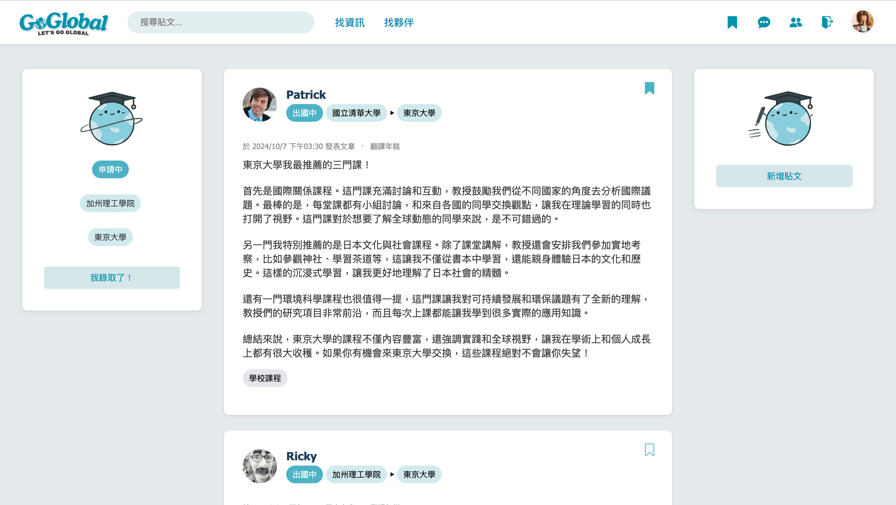
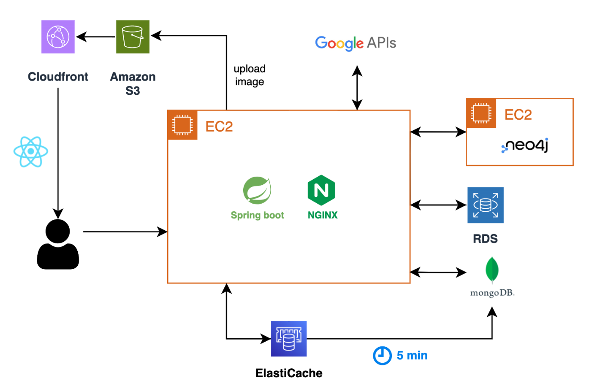

# GoGlobal
a platform specifically designed for exchange and international students.

Check out the demo of the project here: [Watch Demo on YouTube](https://www.youtube.com/watch?v=bzceF2sja3w)

## Project Overview

Students studying abroad often face two key challenges: scattered information and difficulty connecting with peers from the same target schools. GoGlobal addresses these issues by offering phase and goal settings, which provide personalized recommendations for relevant information and student connections throughout the application and study process.

## Features

### 1. Phase and Goal Setting
- **Phase Setting**: Users can set their current phase, including:
  - Applying
  - Accepted
  - Abroad
  - Returned

- **Goal Setting**: Users can set their school goals related to the exchange program:
  - Home School
  - Interested Schools
  - Target Schools

### 2. Information
- **Content Recommendation Algorithm**: Recommends relevant articles based on the user’s selected schools, countries, browsing tags, and post timing.

- **Post Features**:
  - Create, edit, delete, and search posts
  - Bookmark and unbookmark posts
  - Leave and delete comments
  - Personal profile page
  - Translation tool

### 3. Friend
- **Friend Recommendation Algorithm**: Recommends companions based on the user’s target schools, shared friends, and interests.

- **Friend Features**:
  - Send, accept, and decline friend requests
  - Friend list and friend request list
  - Real-time chat rooms

## System Architecture

## Tech Stack

### Backend
- **Spring Boot**: Used to build the backend application, leveraging Spring MVC to implement RESTful APIs, improving maintainability and readability.
- **Spring Security**: Handles authentication and authorization within the application, ensuring secure access control.
- **JWT (JSON Web Tokens)**: Used to securely manage API authentication with a stateless token-based mechanism.

### Frontend
- **React**: The main framework for building dynamic, responsive single-page applications (SPA) with a focus on user experience.
- **React Router**: Provides efficient routing management, allowing smooth navigation across multiple pages within the frontend application.

### Databases
- **MySQL**: The primary relational database used to store structured user information such as email and password, providing data consistency.
- **MongoDB**: A NoSQL database used to store unstructured data such as posts, chat history, and browsing records.
- **Neo4j**: A graph database that manages social connections (friendships, interests, schools) and supports friend recommendation algorithms by matching users based on mutual friends and shared interests.
- **Redis**: A caching system used to accelerate data retrieval for user data and browsing history, enhancing application performance. Browsing history is first cached in Redis before being batch-written to MongoDB.

### Tools
- **Visual Studio Code**: The primary development environment for writing, debugging, and managing code.
- **Maven**: A build automation tool used for dependency management and building Spring Boot applications.
- **Git & GitHub**: Version control systems used for managing code versions.

### Service Integrations
- **Google Translate API**: Integrated within the platform to provide translation services, enhancing multilingual support for users.

### Cloud Deployment
- **AWS Route53**: Used for DNS management, providing stable domain name resolution services.
- **AWS S3**: Utilized to store user-uploaded images and other static assets, offering a highly available storage solution.
- **AWS CloudFront CDN**: Used to accelerate content delivery globally, optimizing static asset loading speeds and improving user experience.
- **AWS EC2**: Hosts the backend application with systemd ensuring automatic startup and stable operation of backend services.
- **AWS RDS**: A managed relational database service used to handle structured data with high availability and automated backups.
- **AWS ElastiCache (Redis)**: A managed Redis service used to store user information and browsing history, providing caching and accelerating database queries, which improves overall application performance.

